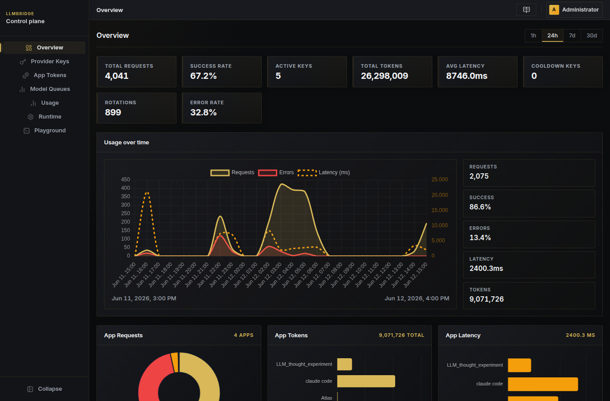
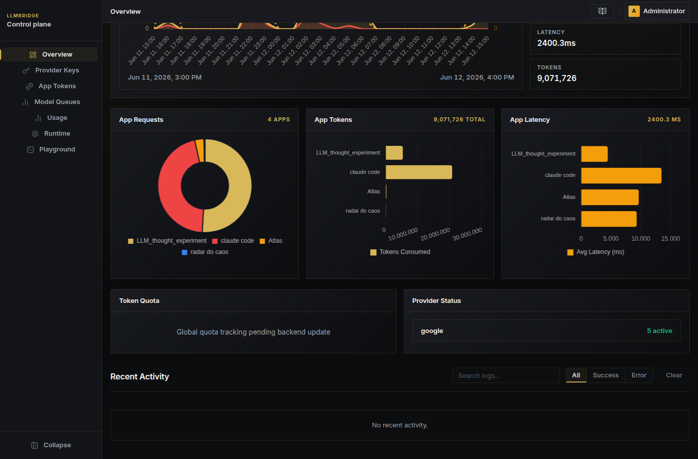

<p align="center">
  
</p>

# LLMBridge

LLMBridge is a local gateway for AI apps. It gives you one endpoint, multiple providers, key rotation, queues, and usage tracking without forcing every client to speak every provider's native API.

`OpenAI-like proxy` `Anthropic-compatible /v1/messages` `Gemini via Claude Code` `Queue-based routing` `Key rotation` `Usage telemetry` `Local admin panel`

If you are new to the project, start here:

1. Install it on your machine.
2. Open the UI.
3. Point your app or Claude Code at `http://127.0.0.1:8009`.

## See It In Action

The admin UI gives you a live view of usage, queues, provider health, and latency.

<p align="center">
  
  
</p>

## What It Does

LLMBridge sits between your apps and your model providers.

It helps you:

- keep one local endpoint for many clients;
- use provider keys more safely with rotation and fallback;
- route requests through queues when you want ordered fallback;
- track usage per app token and per project;
- inspect runtime, queues, keys, logs, and telemetry in the admin UI;
- talk to Claude Code through an Anthropic-compatible surface.

## Best For

- people who want a stable local AI gateway;
- teams with multiple provider keys;
- apps that need a single place for routing and telemetry;
- Claude Code users who want to point at a local bridge.

## Quick Start

### 1. Install

Linux:

```bash
rm -rf "$HOME/apps/LLMBridge" && mkdir -p "$HOME/apps" && git clone https://github.com/lucashahnndev/LLMKeyRotator.git "$HOME/apps/LLMBridge" && cd "$HOME/apps/LLMBridge" && bash bootstrap.sh
```

Windows PowerShell:

```powershell
if (Test-Path "$HOME\apps\LLMBridge") { Remove-Item "$HOME\apps\LLMBridge" -Recurse -Force }
mkdir "$HOME\apps" -Force
Set-Location "$HOME\apps"
git clone https://github.com/lucashahnndev/LLMKeyRotator.git LLMBridge
Set-Location .\LLMBridge
.\bootstrap.bat
```

Run PowerShell as Administrator on Windows before starting the bootstrap.
These commands always start from a clean clone, so rerunning them pulls a fresh copy of the repository.

If you want to launch the scripts manually:

- Windows: [`bootstrap.bat`](bootstrap.bat)
- Linux: [`bootstrap.sh`](bootstrap.sh)

### 2. What the installer prepares

The bootstrap will:

- create a local Python virtual environment;
- install backend dependencies;
- install frontend dependencies and build the UI;
- create or repair `backend/.env`;
- create the local SQLite database;
- run the database migrations;
- register the service automatically on Linux or Windows.

If `SECRET_KEY` or `ADMIN_PASSWORD` is missing, the installer generates them for you.

### 3. Open the UI

- frontend: `http://127.0.0.1:4173`
- backend: `http://127.0.0.1:8009`

The first place to check is the admin UI. It is where you can see the runtime, keys, queues, usage, and other operational details.

### 4. Point Claude Code at LLMBridge

Use this when you want Claude Code to talk to the gateway:

```json
{
  "claudeCode.preferredLocation": "panel",
  "claudeCode.environmentVariables": [
    {
      "name": "ANTHROPIC_BASE_URL",
      "value": "http://127.0.0.1:8009"
    },
    {
      "name": "ANTHROPIC_AUTH_TOKEN",
      "value": "app-token-example"
    },
    {
      "name": "ANTHROPIC_MODEL",
      "value": "queue/gemini"
    }
  ]
}
```

You can also test it in a terminal:

```bash
export ANTHROPIC_BASE_URL="http://127.0.0.1:8009"
export ANTHROPIC_AUTH_TOKEN="app-token-example"
export ANTHROPIC_MODEL="queue/gemini"
claude
```

If you are on Windows CMD:

```cmd
setx ANTHROPIC_BASE_URL "http://127.0.0.1:8009"
setx ANTHROPIC_AUTH_TOKEN "app-token-example"
setx ANTHROPIC_MODEL "queue/gemini"
```

## Common Paths

Use these route styles:

- `provider/model` for a direct upstream model route;
- `queue/name` for a logical queue that resolves to one or more candidates.

Examples:

- `google/gemini-3.1-flash`
- `openai/gpt-4o-mini`
- `openrouter/anthropic/claude-3.5-sonnet`
- `queue/gemini`
- `queue/production`

## Logging and Offline Install

The bootstrap uses local assets when possible.

- On Windows, NSSM can be provided from `bin/` for offline installs.
- Logs and traces are controlled through `backend/.env`.
- The installer keeps the service setup local instead of downloading extra tools during bootstrap.

## Need More Detail?

If you want the technical contract or the project context, read:

- [proxy spec](agent/specs/proxy.spec.md)
- [docs overview](docs/overview.md)
- [deployment spec](agent/specs/deployment.spec.md)
